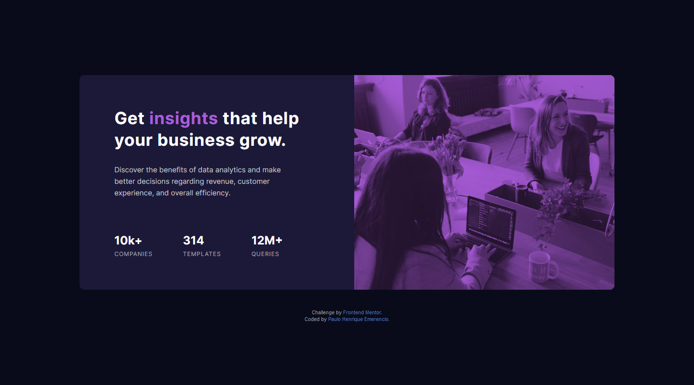

# Frontend Mentor - Stats preview card component solution

This is a solution to the [Stats preview card component challenge on Frontend Mentor](https://www.frontendmentor.io/challenges/stats-preview-card-component-8JqbgoU62). Frontend Mentor challenges help you improve your coding skills by building realistic projects. 

## Table of contents

- [Overview](#overview)
  - [The challenge](#the-challenge)
  - [Screenshot](#screenshot)
  - [Links](#links)
- [My process](#my-process)
  - [Built with](#built-with)
  - [What I learned](#what-i-learned)
  - [Continued development](#continued-development)
  - [Useful resources](#useful-resources)
- [Author](#author)
- [Acknowledgments](#acknowledgments)

## Overview

### The challenge

Users should be able to:

- View the optimal layout depending on their device's screen size

### Screenshot of my solution



### Links

- Solution URL: [Click to see my solution working!](https://paulo-emerencio.github.io/stats-preview-card-component/)
- Live Site URL: [I don't have a site yet, so here is My Anime List](https://myanimelist.net/animelist/Hollow-Soulheart)

## My process

### Built with

- Semantic HTML5 markup
- CSS custom properties
- Flexbox
- Mobile-first workflow

### What I learned

I didn't know how to turn the black and white image from the images folder into that purple duotone of the design, so I had the idea to create a purple pseudo element, place it over the image and use the multiply blending mode. When it worked I was so happy 🤩🥳

```css
.bg-image {
    position: relative;

    width: 100%;
    height: calc(165px + 20vw);

    background-size: cover;
    background-position: bottom 10% center;
    background-image:
        var(--img-gradient),
        url(../images/image-header-mobile.jpg);
}
.bg-image::after {
    content: '';
    
    position: absolute;
    left: 0;

    width: 100%;
    height: 100%;

    background-color: var(--accent-color);
    mix-blend-mode: multiply;
}
```

### Continued development

I had a hard time trying to use Sass in this challenge, so I gave in (for now) and just used pure CSS. I'll now focus in mastering Sass and will for sure use it in the next challenge.

### Useful resources

- [MDN](https://developer.mozilla.org) - The documentation will always be by my side.

## Author

- Frontend Mentor - [@Paulo-Emerencio](https://www.frontendmentor.io/profile/Paulo-Emerencio)
- Digital Innovation One - [@p_emerencio](https://web.digitalinnovation.one/users/p_emerencio?tab=achievements)
- My youtube channel - [Rock com Legendas](https://www.youtube.com/channel/UCCfv_Hs7Zs4MNAHKaJk7PGw)
- Support my channel - [Padrim](https://www.padrim.com.br/rockcomlegendas)

## Acknowledgments

My special thanks to [Marco Bruno Dev](https://www.twitch.tv/marcobrunodev) and [Kevin Powell](https://www.youtube.com/kepowob), they both taught me a lot of HTML and CSS.
